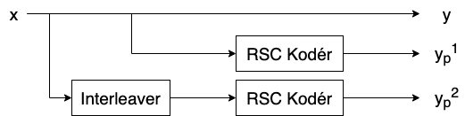
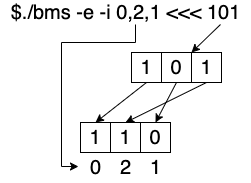
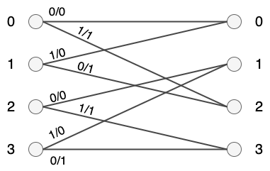
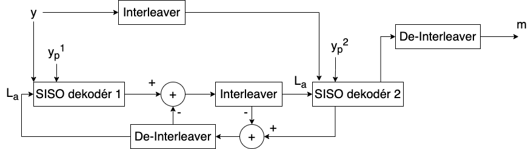

# BMS - Bezdrátové a mobilní sítě

#### Vypracoval: Dominik Švač (xsvacd00)
#### Rok: 2021

### Zadanie

Naprogramujte v jazyku C|C++ jednoduchú konzolovú aplikáciu (bms), ktorá bude realizovať kódovanie (encoding) a dekódovanie (decoding) vstupnej správy pomocou turbo kodéra vo variante znázornenej nižšie.

#### Kodér:
Kódový pomer turbo kodéra je ⅓.
Funkcia kodéru je znázornená na nasledujúcom obrázku:



Kodér teda z 1 datového bitu vyrobí 3 bity, y originálny (systematický) a dva kódové bity yp$^{1}$ a yp$^{2}$.
Funkciou interleaveru je zmeniť poradie bitov pred vstupom do druhého kodéra. Jedná sa o jednoduché preskladanie bitov ako je znázornené na obrázku:



Oba RSC kodéry sú rovnaké a ich funkcia je popísaná priloženým Trellis prechodovým diagramom [1,2]:



#### Dekodér:

Funkcia dekodéru je znázornená na nasledujúcom obrázku:



SISO MAP dekodér využíva pre dekódovanie vstupu BCJR algoritmus. Jeho úlohou je odhadnúť pravdepodobnosť bitov podmienenú prijatou postupnosťou znakov (reálnych čísel).

### Parametre programu:
```
./bms -e -i <interleaver> <<< vstup=[postupnosť bitov v LSB poradí] (slúži pre zakódovanie)
./bms -d -i <interlevaer> <<< vstup=[postupnosť reálnych čísel oddelených desatinnou čiarkou] (slúži pre dekódovanie)
```

\<interleaver> slúži pre zadanie konfigurácie interleaveru vo tvare: x,y,z,... kde x,y,z sú prirodzené čísla (0,1,2,...) ktoré určujú ktorý bit z pôvodného poradia postupnosti bitov bude na danú pozíciu premiestnený.

### Funkcie programu:
Program berie vstup z štandardného vstupu stdin a výstup programu je vypísaný na štandardný výstup stdout. Pri kódovaní (-e) bude vstupom programu predpis funkcie interleaveru a postupnosť bitov (znaky [0,1]), dĺžka vstupnej postupnosti bitov je rovnaká ako "dĺžka" interleaveru. Pri dekódovaní (-d) bude vstupom programu predpis funkcie interleaveru a postupnosť "prijatých" symbolov (reálnych čísel) napr. 0.927,0.792,-1.499,-1.094.

#### Príklad kódovania

Program musí vstupný reťazec zakódovať pomocou turbo kodéru. Príklad ako vyzerá použitie programu v tomto režime je:

```
$./bms -e -i 0,2,1 <<< 101
111001101001001
```

```
$./bms -e -i 2,0,5,3,1,4 <<< 100111
110001011110101101001001
```

```
$./bms -e -i 3,2,4,1,5,0 <<< 101010
110001101001111000111000
```

#### Príklad dekódovania

Validným vstupom programu sú iba reálne čísla reprezentujúce jednotlivé bity prenášanej správy oddelené destinnou čiarkou.

```
$./bms -d -i 0,2,1 <<< 0.8117
286904216565,0.9329612586102796,0.466240262565775,-1.1806385220545133,-1.0073440029673555,
                                      1.167453729725047,1.0847824037646787,-1.3599551228550821,1.321380961799438,
                                      -1.2091285333721777,-0.22512460716740712,1.3137765324710164,-0.7200147467769947,
                                      -1.22179391781076,0.42425885852168255
101
```

```
$./bms -d -i 2,0,5,3,1,4 <<< 1.2673732938260902,0.9062754598095913,-0.5261228717625472,-1.051000488090995,-1.358284600201495,
                                      0.9221731021029576,-0.6699131123010096,0.9710620196604015,1.4166806214480285,1.374065959795744,
                                      0.8578688067934579,-0.42160698533656127,0.6608855405460567,-0.6664646393834985,1.1900964714639715,
                                      1.5818003285495221,-0.9596056647905428,0.8789795198071529,-0.7684037932561387,-0.9074278707601757,
                                      1.0946931633674326,-0.5054514927378362,-1.2069294195212144,0.9812531858982751
100111
```

```
$./bms -d -i 3,2,4,1,5,0 <<< 1.203522167996614,1.2524844599137366,-1.376652806781083,-1.1422068653345685,-1.2667189034281865,
                                      0.16532110596681504,0.8562109486407058,-0.5792181377441328,1.5974214750440114,-1.3827773350455494,
                                      -1.830617821365228,0.7301502025398654,0.3969880169063571,0.6840849405756638,0.8833811806506193,
                                      -0.8131391054538506,-0.8846224520962913,-1.0514103061775337,1.0024725376951729,0.8658803562335791,
                                      1.0612270495559868,-0.8835867176598403,-1.2462963652859267,-1.133735369328358
101010
```

### Testy

```
./test.sh - spustia sa testy
```